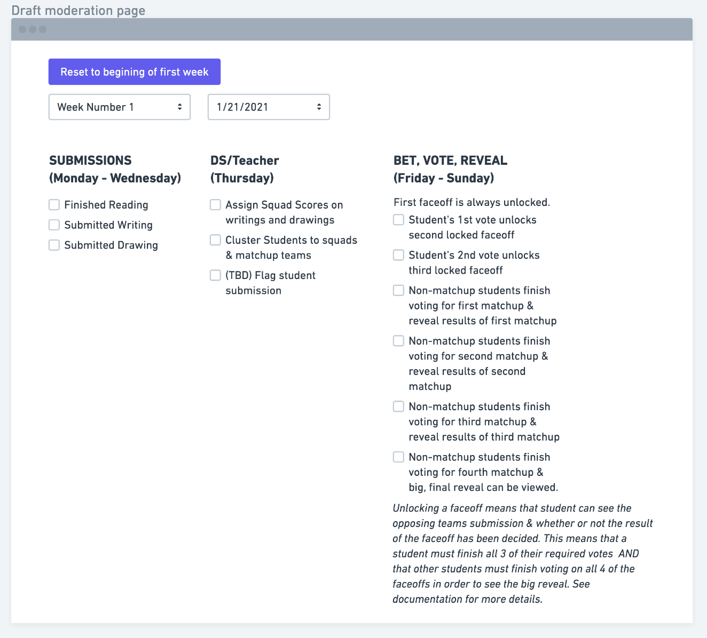

# How StorySquad should work

_Last updated by Labs30 01.28.21_

[Stakeholder Demo of Desired App](<[https://docs.google.com/presentation/d/1DKJjCHwA_W9JCAaiofN5bwVCe7MvG8NMJVBSyzeR2qw/edit#slide=id.g814549c2e8_0_7](https://docs.google.com/presentation/d/1DKJjCHwA_W9JCAaiofN5bwVCe7MvG8NMJVBSyzeR2qw/edit#slide=id.g814549c2e8_0_7)>)

## Notes

Students that started at the same time will be placed in "cohorts." This will allow students to progress through a chapter book for their reading, and synchronizes the writing and drawing prompts for students in that cohort.

# Student Steps:

## Overview of week:

(This is from a draft wireframe of the dev's `/moderation` page that is intended for devs to quickly mock any needed steps. Note the numbered order of every step.)

## Step 1 (Monday: read chapter)

All students in the same cohort read the same assigned chapter/story & click a button at the end to confirm they finished.

1. Front end should display whether or not it has been read.

## Step 2 (Monday-Wednesday: submissions, but only after finishing step1), (Thursday is mandatory teacher/adult review)

Draw & write

1. Students draw a picture based on a sentence in the story read & handwrite their own fictional story using the characters in the reading.
2. Students then submit the drawing and writing in the app. After they are submitted, each task's respective checkboxes should change from unchecked to checked.
3. On **Thursday**, stories are reviewed by a teacher and analyzed by DS. Writing and drawings will receive a "squad score" by DS & then be grouped with a student of similar skillset into a "team" (also called a "squad"). Each 2 person team/squad will be matched with a similarly skilled team to compete against in a "Weekly matchup." The "matchup" refers to the overall squad-vs.-squad "face-offs" taking place, and will be displayed on the matchup page as 4 face-offs.

## Step 3 (Friday - Sunday: allotting/betting, voting, and suspense before the reveal)

Point Share Stage. The student reads through a "Squad portfolio" composed of their own work and the work of their teammate. Each student then invests/allocates 100 points across the squad portfolio. (Imagine it as a betting phase. Student bets points according to how they likely they think each writing/drawing is to win against a competing team's unknown submissions)

Each submission gets a minimum of 10 points, and each student privately decides how to allocate the remaining 60 points according to their own thoughts on what is most likely to win the "face-off's". (teammate will do the same, and the competing team will likewise do the same for their work) A "face-off" is the individual competition between 2 pictures or 2 writings.

1. The point sharing page needs to ensure that exactly 100 points are allocated by every student, and if the student fails to allocate points, each automatically gets 25 points.
2. After students submit their point-shares (bets), the face-offs are made.
   - A team's picture with the highest point-allocation (bet) is paired with the opposing team's picture with the highest point allocation, and the total of all the points allocated on those 2 pictures is at stake on that pairing. The 2 remaining pictures will be matched & all the points invested in them will be at stake on that pairing.
   - The process is the same for stories.
3. Matchups will be displayed on a Matchup Dashboard, where the student can see their team matchups & the total points allocated to each matchup. Originally, the student can view all of the submissions in their "squad portfolio" & only the opposing team's submission from the lowest-point face-off. As the student votes in the next step, they unlock the next 2 face-offs and can see more of the opposing team's submissions and if there has been a winner for each face-off yet. (This means that a student must finish all 3 of their required votes AND that other students must finish voting on all 4 of the faceoffs in order to see the big reveal.)

## Step 4 (Friday - Sunday, Voting.)

Each student will vote on 3 face-offs for other teams. Note, a student will never vote for their own team's matchups, only for unrelated teams. Students should not know whose work they're voting for. Students will vote entirely on their own opinions on what is subjectively better and can give emoji feedback.

- As mentioned previously, as a student votes on an external matchup's faceoff, they unlock the ability to see one more submission & result on their own matchup page.

## Reset to New Week

TBD

## Glossary of terms

(Provided by stakeholder at [this link](<[https://www.notion.so/How-the-app-should-work-a39c5ddfe3614cea8e41dc3da4991c87#d683ba82f1ad45b8aece9164b17f03c3](https://www.notion.so/How-the-app-should-work-a39c5ddfe3614cea8e41dc3da4991c87#d683ba82f1ad45b8aece9164b17f03c3)>))

**"Monster app"** refers to the weekly Story Squad game being developed in Lambda Labs.

**"Mini app"** refers to the separate free daily story contest that is already launched.

**"Novel"** refers to the overarching narrative that populates the READ portion of each week. The plan initially is to use the 100,000 word manuscript entitled _Zoom & Boom @ A Saltwater Startup_, which retells the myth of Medusa through social media chatter of sea animal characters on a little league soccer team set in the Galapagos. At the current "Read" portion of ~15-18 pages per week, this novel take 5-6 months for a user to consume.

**"Mission"** refers to one week's worth of gameplay from Read/Write/Draw—>Point Share—>Matchup Dashboard with emoji feedback & Independent Voting with unlocking—>Outcome reveal.

**"Cohort"** refers to all the users going through the weekly sequence at the same point in the story. This will be referred to by weeks, so there is a week 1 cohort that is just starting the story, a week 2 cohort, etc.

**"Teammate"** refers to your assigned partner for a single week. A user will have different teammates week-over-week based on their "Write" submission's NLP Squad Score.

**"Squad Score"** refers to the DS score that the transcribed handwritten side quest earns. Kids are clustered in teams and matched up against opponents of similar Squad Scores to maximize the uncertainty around the team that wins >200 points in the 4 head-to-head faceoffs; this implies that the determining factor is likely how kids quantify their aesthetic evaluation of their squad's portfolio during the "Point Share" phase of the weekly sequence.

**"Team name"** refers to the arbitrary Mad-Libs style mashup of nouns that you and your teammate arbitrary select without knowledge of the other's choice. On the roadmap for future Labs team.

**"Avatar"** refers to the action figure caricatures that represent a user through the weekly screen sequence.

**"Squad" or "Team"** both refers to a user and their assigned teammate. (NB. This term is used differently than the way Emilio Ramirez's on Trevor Martin's Labs 28 team used it in his Medium post.)

**"Squad Portfolio"** is the collection of 2 written side quests and 2 illustrations submitted between you and your teammate that week.

**"Points"** refers to each player's 100 points that they individually invest over their "squad portfolio" in the "point share" phase. 4 players (2 teammates playing against 2 teammates) x 100 points available to be assigned by each individual player = 400 points at stake in each weekly matchup. These points cascade through the matchup dashboard, determine which squad wins the weekly matchup, and serve as an aggregated metric in the league leaderboard showing cumulative points and weekly record.

**"Story" or "Side Quest"** and **"Illustration" or "Picture"** refers to user submissions during the WRITE and DRAW portions respectively done in the early part of the user's weekly sequence. Both side quests (functioning as imaginative fan fiction) and pictures should be handwritten or hand-drawn by users. These are creative user-generated content images that get submitted as JPEG, PNG, or HEIC files. Internal docs sometimes refer to stories and pics are sometimes referred to as **"CCS,"** which stands for creative content submissions.

**"Opponents"** refers to the team of 2 players you and your teammate are opposing that week. Opponents, like teammates, get shuffled week-over-week.

**"Matchup" or "Weekly Matchup"** refers to the overall squad-vs.-squad faceoffs taking place across the 4 rectangles (green box = most points at stake, then red, yellow, blue boxes). If a user and their teammate win the week capturing >200 points, they become 1-0 in their record.

**"Faceoff"** refers to the story-vs.-story or picture-vs.-picture individual competition on the Matchup Dashboard. Each faceoff gets routed to 3 independent evaluators who vote for whichever 1 of the 2 works they like better.

**"Unlocking"** refers to the incremental nudge to drive a user to fulfill their independent voting obligation by offering the small incentive of unlocking your opponents' side quest or illustration so you can scope out which work has the advantage to build anticipatory pleasure in imagining the result and how it impacts the overall matchup of 4 faceoffs. After each voting session as an independent evaluator, the user gets routed back to the matchup dashboard, but this time their opponent's side quest or picture in the blue box (with the fewest points at stake) has been unlocked and is able to be clicked on so that a modal popout window emerges. This scoping out the enemy's work allows a player to assess the likelihood of the faceoff's outcome. During the second voting session, their opponent's side quest or picture yellow box submission is unlocked; similarly, the opponent's side quest or picture in red box unlocks after the 3rd and final independent voting session. The green box, which represents the most number of points at stake and has a disproportionate impact on the overall matchup outcome, is never unlocked until the final reveal sequence at the crescendo of the week.

**"Emoji Feedback"** refers to the string of 4-6 emojis that every voter is required to leave on a user's side quest or picture during the independent voting period regardless of whether their work receives the vote. This emoji feeeback is routed back to the author as an additional lever to build anticipatory pleasure about the result, as kids speculate about the oracle-esque / cryptic significance of the emoji string. The notification that a user has emoji feedback to ponder should occur as soon as the independent voter submits it, and it should be collated so the string of emojis by one voter is preserved to allow the kid the chance to interpret what the voter is trying to communicate as feedback.

**"Independent Voting" or "Voting"** refers to the part of the weekly user flow that requires user engagement once WRITE and DRAW portions are submitted. (Conversely, the point share stage can be defaulted to automate a point split of 25-25-25-25 if user's required action hasn't been input within the timeframe while still driving the weekly sequence of gameplay forward.) This independent voting stage requires a user to vote on 3 faceoffs from _other_ matchups outside of their own but still generated by users in the weekly cohort so everyone, authors and evaluators, are up to the same point in the overarching READ story. During this independent voting process, each faceoff gets routed to an odd number of independent evaluators, who only are able to examine the 2 opposing pieces of user-generated creative content side-by-side and select a winner. All contextualizing metadata like authorial attribution (i.e., username, etc.) or matchup context (i.e., how many points attached, etc.) are stripped so the independent evaluator simply sees 2 side quests or 2 pictures side-by-side and: 1) votes for the one they prefer (for whatever reason), and 2) leaves mandatory emoji feedback that gets immediately routed back to each author. The unlocking mechanism offers users incremental incentivizes to fulfill this mandatory part of the weekly sequence. If a user does NOT fulfill this voting obligation, the reveal stage is withheld until they complete voting even after the deadline to avoid a "free rider problem." This edge case should allow the remaining 3 players in the matchup to move forward with the reveal and weekly game reset into the next week's READ/WRITE/DRAW sequence, while forcing the delinquent player to vote (even if this doesn't affect the results of the matchup being voted upon since it theoretically occurs after the reveal sequences in the outside matchups, which in effect means these delinquent votes will not count, but are still necessary to enforce).

**"Reveal"** refers to way the outcome of each of the faceoffs in a matchup gets announced. In the Figma, this takes place from blue—>yellow—>red—>green boxes, as the intensity ratchets up as the points at stake increases. There needs to be the chance to for players to scope out the opponents' creative submission in the green box during the reveal sequence, since that has not been unlocked up until this point of the sequence.

**"Record"** refers to a user and their squadmate's / teammate's tally of weekly overall matchup victories. For example, let's say that after 4 weeks of gameplay, you and your weekly partner (who changes week-over-week) win 2 of those weeks by having the pieces in your squad portfolio capture at least 200 points in the overall matchup, but lose the other two weeks. Your record is 2-2, with a subordinate sorting factor of how many points your work on its own has captured in the faceoffs.

**"Leaderboard"** refers to the ranked record of users within a cohort and a historical register of users on the platform at that point in the game. (If you're at week 5, it has a listing of all players' records in your cohort as well as another data table listing the records of every player historically who has made it to this point in the game.) See the example Google Sheet for column headers and sorting logic.

**"Trophy Room"** refers to custom trophies a user earns for proceeding further into the game. On the roadmap for future Labs teams.

**"Adventure Passport"** refers to a Pinterest-style board listing your own portfolio of side quests and illustrations as well as others you have selected to pull into your custom-version of the overarching story. On the roadmap for future Labs teams. (edited)
